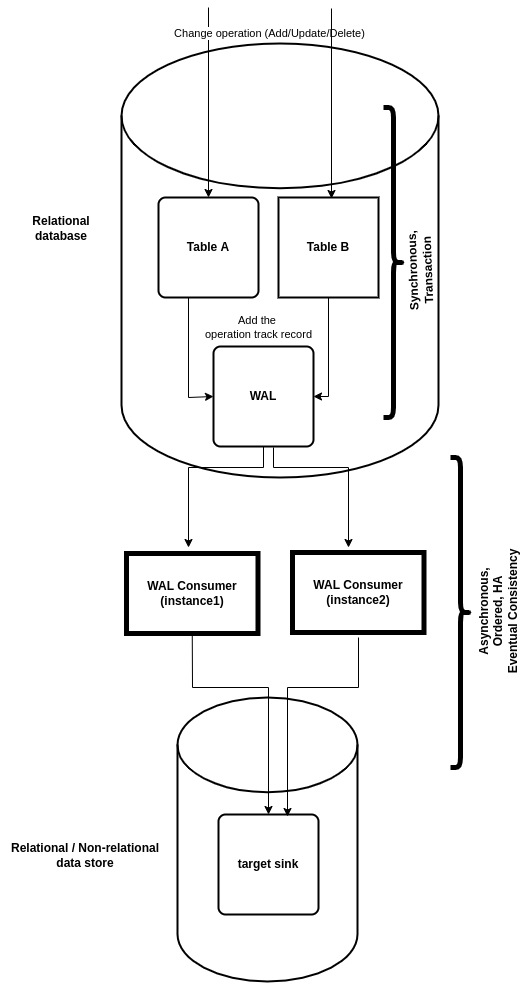

# WAL Consumer

You can use this mini-library when you want to synchronize or process the changes on a table in a
relational database (e.g., you want to transfer the changes, to another relational database, a NoSQL
database, a key-value store, a queue, etc.). There are 2 types of methods here: synchronous methods
that use mechanisms
like [distributed transactions](https://en.wikipedia.org/wiki/Distributed_transaction) and
asynchronous methods
that support [eventual consistency](https://en.wikipedia.org/wiki/Eventual_consistency). The first
approach has several [drawbacks](http://softwarephilosophy.ninja/distributed-transactions).
Furthermore, not all kinds of source/sinks are supported for distributed transactions by the
existing frameworks. So it is common to use eventual consistency methods in many cases. This library
helps you in this area. These are the assumptions of this library:
You are going to synchronize or process the changes from a source of a relational table. You are
using Hibernate or JPA in the relational side. So you have some Entity objects.

In these conditions, these are the steps a client should follow:

1. Register the WalEntity (the special Entity provided by this library) object to the list of your
   ORM entities.
2. Whenever you apply an operation in your database, also add a WalEntity in a same transaction that
   the operation is applied.
3. Run a new instance of WalConsumer class and provide it with your desired synchronization/process
   callback. You can see these steps in a sample provided in the test package. Implementing these
   steps, then the consumer reads sequentially from the WAL and provides the head item to the
   provided callback which is responsible for the process. Note that it is safe to create two
   concurrent WAL consumer to read the same WAL table because whenever a consumer is consuming a
   record, the other ones will be blocked. This is useful for providing HA (high availability) by
   multiple instances.